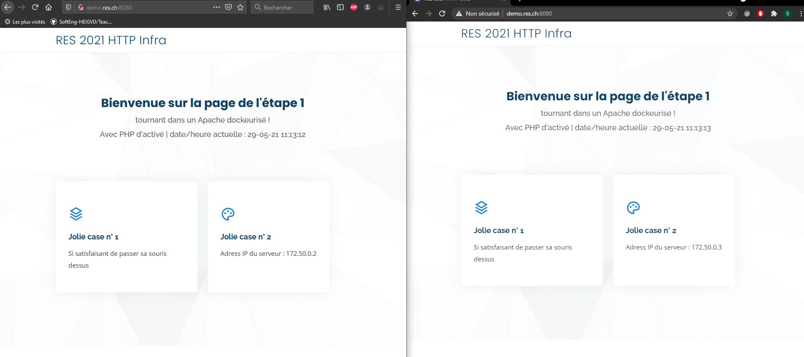

## Extra 1

#### Mise en place

1. L'image de la step 1 a été adaptée pour pouvoir vérifier que l'implémentation de cette étape est fonctionnelle. Rebuild l'image si besoin de vérifier la cette étape.  


2. Configurer le réseau virtuel sur lequel les conteneurs vont se connecter :

    Dans le fichier `docker-compose.yml`, modifier
    ```
    - subnet: 172.50.0.0/16
    ```
    &nbsp;

3. Assigner des adresses IP aux conteneurs :

    Dans le fichier `docker-compose.yml` assigner les adresses ip pour les différents containers (apache2_1,apache2_2, node_1, node_2, apacheproxy).

4. Configurer les variables d'environnements qui seront transmises au conteneur apache reverse proxy :

    Dans le fichier `docker-compose.yml`, modifier
    ```
    - STATIC_APP_1=172.50.0.2
    - STATIC_APP_2=172.50.0.3
    - DYNAMIC_APP_1=172.50.0.4:3000
    - DYNAMIC_APP_2=172.50.0.5:3000
    ```

    Attention, il faut évidemment que ces valeurs soient cohérentes avec les IP assignées aux conteneurs au point 3.  
    

5. Démarrer les conteneurs avec `./run-container.sh` ou la commande `docker-compose up -d`

#### Demo

Pour pouvoir prouver la fonctionnalité de cette étape, nous avons modifié (légèrement) le code source de la page d'acceuil du site de la step 1. On affiche dynamiquement l'adresse IP du serveur chargé d'envoyer la requête au client `<p class="description">Adress IP du serveur : <?php echo $_SERVER['SERVER_ADDR']; ?></p>`.  

En effectuant 2 requêtes sur la page d'accueil presque en parallèle et en ayant un peu de chance, on obtient une réponse d'un serveur différent selon la requête




#### Implémentation de la solution

La solution est une extension de l'étape 5. Dans la suite, nous allons détaillé les modifications apportées par rapport à l'étape 5.

##### Dockerfile

Le load balancing nécessite des activations de modules apache supplémentaires au niveau du serveur reverse proxy. On a donc ajouté l'activation des modules `proxy_balancer lbmethod_byrequests`. A noter que le dernier définit l'algorithme pour la répartition de tâches et que d'autres sont disponibles.

##### docker-compose.yml

Il a fallu ajouter des containers à démarrer. On a donc ajouter un serveur static et dynamique supplémentaire.  

Ensuite, pour chaque conteneur, il faut pas oublier de lui attribuer une adresse IP statique:

```
networks:
      mynetwork:
        ipv4_address: 172.50.0.x
```

Pour le conteneur proxy, il faut lui passer deux variables d'environemment en plus, voir ci-dessus (Mise en place, point 4).  


##### Configuration apache

Le fichier `templates/config-template.php` a été modifié pour mettre en place le load-balancing.  
La directive `<Proxy>` permet de définir un nom pour un groupe de serveurs qui peuvent se partager les tâches de réponses aux clients. Dans cette dernière, avec la directive `BalancerMember` on définit tous les serveurs.  

Pour terminer, il suffit juste d'adapter les directives `ProxyPass` et `ProxyPassReverse` et au lieu de spécifier un serveur précis comme deuxième argument, il suffit de mettre le nom du groupe de serveurs.

