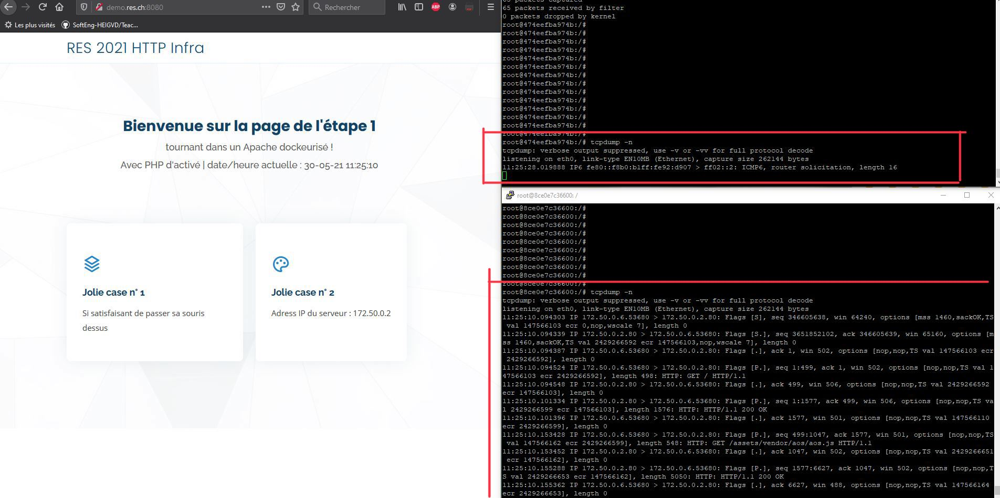

## Extra 2

#### Mise en place

1. Les images de la step 1 et 2 ont été adaptées pour pouvoir vérifier que l'implémentation de cette étape est fonctionnelle. Rebuild les images si besoin de vérifier cette étape.  

2. Cette étape est une extension de l'étape extra 1, vérifier que l'extra 1 fonctionne surtout que la config des réseaux est OK dans le fichier `docker-compose.yml`.

3. Rebuild l'image du reverse proxy avec le script `build-image.sh    

4. Démarrer les conteneurs avec `./run-container.sh` ou la commande `docker-compose up -d`

#### Demo

A la step extra 1, le load balancer ne supporte pas les "sticky session". Par exemple, lors que l'on charge l'index de la page web statique qui contient des liens vers d'autres fichiers à charger, les requêtes se font sur les deux serveurs statiques même si la page principale `index.php` est retourné par le premier serveur. Voici un exemple avec un capture tcpdump:  
  

Après implémentation de cette solution, lorsque l'on demande la page d'accueil du site, toutes les requêtes pour les autres ressources inclues dans l'index se font uniquement sur un serveur. Illustration avec tcpdump:  
  

Pour le serveur dynamique, comme il n'y pas d'état et que juste une "page" est chargée à chaque requête, la répartition se fait avec l'algorithme round-robin. Avec une capture tcpdump sur le reverse proxy, on peut s'apercevoir que les requêtes sont réparties entre les deux serveurs l'un après l'autre:  
   
 

#### Implémentation de la solution

La solution est une extension de l'étape extra 1. Dans la suite, nous allons détaillé les modifications apportées par rapport à cette dernière.

##### Dockerfile

Pour pouvoir appliquer des cookies chez l'utilisateur, il faut load le module `headers` d'apache. On installe aussi l'outil tcpdump pour la vérifier si nécessaire cette étape.  

##### Configuration apache

Le fichier `templates/config-template.php` a été modifié pour mettre en place le load-balancing supportant la sticky session.  
On retrouve la directive `Header` qui permet de set une cookie (`ROUTEID`) avec le numéro de la route utilisée par le client pour charger la page.  
Pour la directive `<Proxy>` de la page statique, on ajoute le numéro des routes à la fin de chaque membre avec `route=x`. On applique aussi `ProxySet` pour indiquer qu'il faut activer la sticky session avec la valeur de la cookie `ROUTEID`.  
Pour le site dynamique, on ne touche rien car le module chargé applique déjà l'algorithme round-robin (voir activation modules apache de l'étape extra 1).

