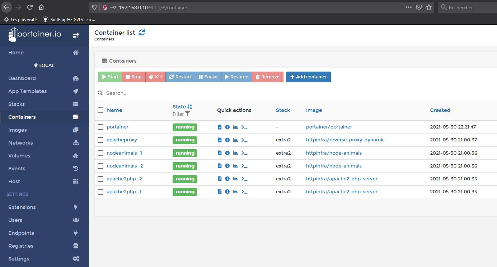

## Extra4  

En recharchant un peu sur les net des "managers" de Docker, nous avons choisi `Portainer`.  
Il offre une interace complète et le déploiement est plutôt simple:  

1. Nous avons choisi de déployer la méthode quick start (https://portainer.readthedocs.io/en/stable/deployment.html#quick-start)
2. Elle exige deux commandes `docker volume create portainer_data` et `docker run -d -p 9000:9000 -p 8000:8000 --name portainer --restart always -v /var/run/docker.sock:/var/run/docker.sock -v portainer_data:/data portainer/portainer`.  

3. Une fois que le container s'exécute, il faut accéder sur sa page web `http://<IP_MACHINE_DOCKER:9000` où IP IP_MACHINE_DOCKER = adresse IP de la machine où docker s'exécute. Ensuite, il faut faire un petit setup (appliquer le mot de passe admin et indiquer qu'il s'agit de manager un serveur docker déployé sur la machine en local).

4. L'interface de management est disponible:  
 
