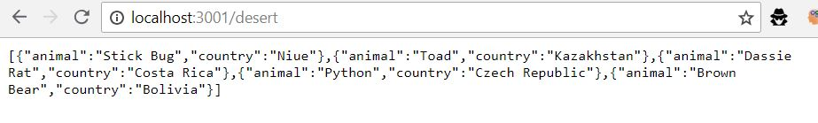
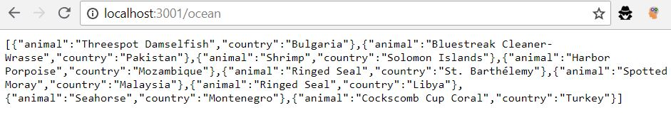

## Step 2

Ce conteneur va déployer un serveur HTTP permettant de retourner au format JSON des animaux ainsi que leurs pays. Les données sont générées aléatoirement grâce au générateur https://chancejs.com/. Le serveur utilise node et la lib https://expressjs.com/

#### Demo

1. Charger les dépendances :
`cd src`
`npm install`

2. Contruire l'image :
`cd ..`
`docker build -t httpinfra/node-animals .` ou `./build-image.sh`

3. Démarrer le conteneur :
`docker-compose up -d`

4. Il est dès lors possible de faire des requêtes HTTP à l'adresse http://localhost:3001/ocean ou http://localhost:3001/desert :

