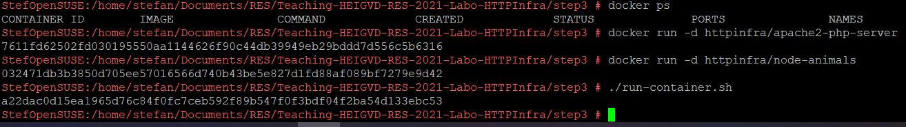
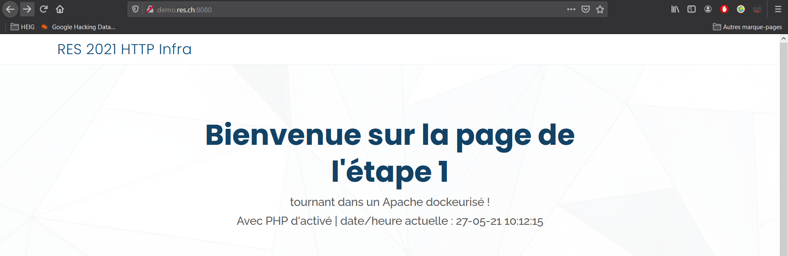
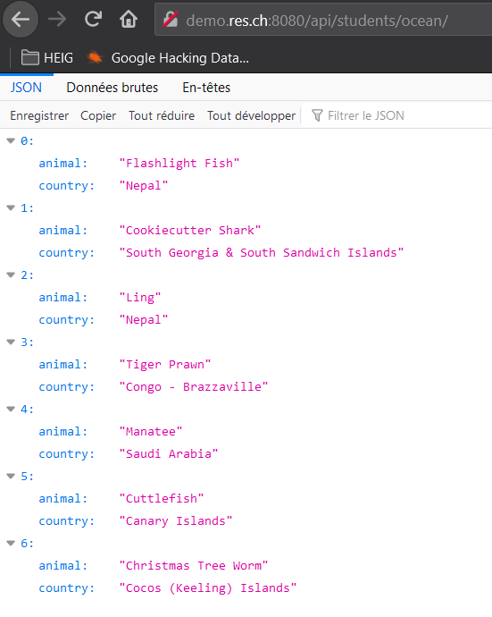
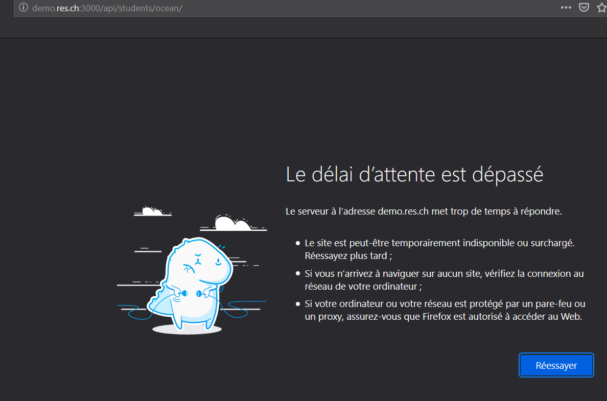

## Step 3

#### Demo

1. Pour effectuer cette démo, il faut avoir build les images des steps 1 et 2. 

2. Contruire l'image de la step 3 :
 `./build-image.sh` présent dans le dossier de la step 3.

3. Démarrer les conteneurs de la step 1, 2 et 3. **Attention** à bien respecter l'ordre indiqué.  
Pour les containers des step 1 et 2, il ne faut pas faire du port mapping, soit:  
`docker run -d httpinfra/apache2-php-server`  
`docker run -d httpinfra/node-animals`  

4. Pour démarrer le container de cette step, exécuter le script :
`run-container.sh`  
**Attention**, il s'agit ici d'une configuration statique du reverse proxy. Dans la config fournit pour cette step, le serveur statique (step 1) est sensé tourner avec l'adresse 172.17.0.2 et le dynmique (step 2) avec 172.17.0.3:3000. Si tel n'est pas le cas, il faut adapter le fichier `config/sites-available/001-default.conf` avec les bonnes adresses et rebuild l'image.

5. Pour consulter les sites webs, il faut faire une entrée dans son fichier `hosts` et lier le domaine `demo.res.ch` à l'adresse IP de la machine où s'exécutent les containers. Ceci est obligatoire car le proxy est configuré pour cet host là.
Les sites webs sont accessibles sur le port 8080:  
  
  
Comme on peut le voir sur ces captures ci-dessus, le reverse proxy "traduit" bien les requêtes selon quel site on veut atteindre (statique ou dynmaique).  

#### Reverse proxy seul point d'entrée

Etant donné qu'aucun port mapping n'est fait sur le serveur statique et dynamique, ils ne sont pas accessible directement depuis l'extérieur. Seul le proxy possède un port mapping pour pouvoir être accédé par tout le monde. Les autres containers sont seulement accessibles par la machine qui fait tourner docker ou alors par les containers s'exécutant dans le même réseau docker.  
S'il on essaie d'accéder directement au site dynamique par exemple, on obtient un timeout:  

#### Configuration statique

La configuration apache qui sert de reverse proxy possède les adresses IP des serveurs web en dur dans sa config. Dans le cas où on a plusieurs autres containers en exécution ou que le range d'adresse du réseau interne de docker n'est plus le même, les containers (web statique et dynamique) vont démarrer avec une autre adresse et la config du reverse proxy se sera plus valable.

#### Configuration

La configuration pour cette étape se trouve dans `config/sites-available/001-default.conf`  
Dans ce fichier, les directives ProxyPass et ProxyPassReverse sont utilisées pour faire le reverse proxy.  
Celles ci permettent de faire des routes dans le reverse proxy.  
On indique quel serveur ainsi qu'éventuellement un sous dossier il faut que le reverse proxy aille chercher lorsqu'il reçoit une requête de la part d'un client (directive ProxyPass).  
L'autre directive (ProxyPassReverse) permet de faire en sorte qu'Apache httpd ajuste l'URL dans les en-têtes Location, Content-Location et URI des réponses de redirection HTTP. 
