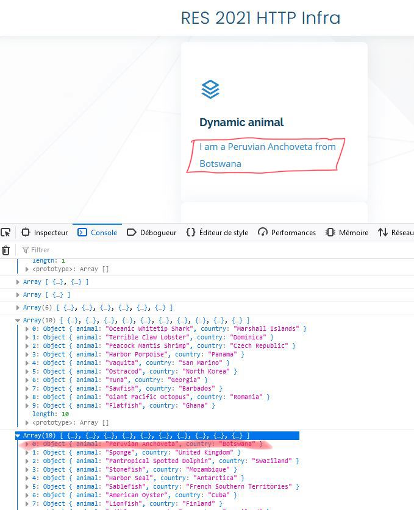

## Step 4

Cette étape est une extension de la première. Seules quelques modifications ont été faites pour accomplir l'étape.

#### Demo

1. Pour effectuer cette démo, il faut rebuild le container de la step 1 avec le script `build-image.sh`. Pour plus de détails, voir la démo de la step 1.

2. Ensuite, il est nécessaire de lancer les containers comme pour la démo de la step 3. S'y référer si besoin.

#### Contenu dynamique

Sur le site, il y un script jQuery qui s'occupe de faire des requêtes AJAX chaque 2 secondes pour changer un contenu du site. Les requêtes ciblent le contenu json généré dynamquement à la step 2. Ensuite, la première ligne du json est récupérée pour être affichée.  

#### Same-origin policy

Pour des raisons de sécurité, il est interdit d'effectuer des requêtes AJAX vers un autre domaine. Dans notre cas, sans reverse proxy, la requête aurait pour cible un autre domaine, car il est situé sur un autre container et donc une autre adresse IP. Avec le reverse proxy, on arrive à "tromper" le client web car il cible le même domaine (le reverse proxy) mais le reverse proxy fait suivre la requête à une autre machine.  
Pour voir la restriction s'activer, nous avons temporairement changé l'adresse cible de la requête AJAX pour voir l'erreur :  

#### Configuration

Pour cette étape, seul un script jQuery a été nécessaire. Il se trouve dans `step4/public-html/assets/js/dynamicAnimal.js`. On s'est fortement inspiré de l'exemple fait dans ls vidéo.  

Pour faire fonctionner le script, nous avons aussi dû ajouter un `id` sur une balise html pour pouvoir y accéder via le script.
