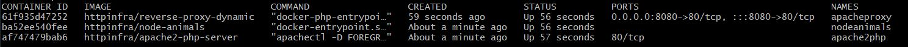
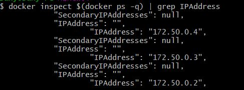
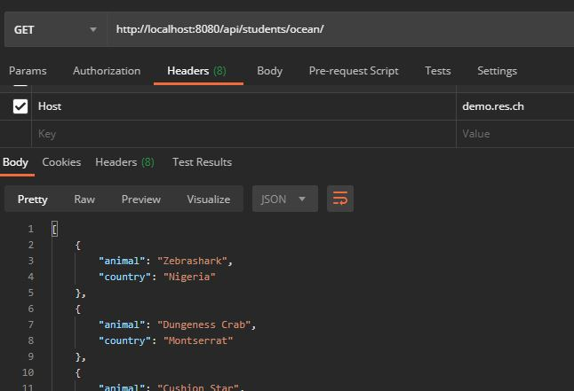
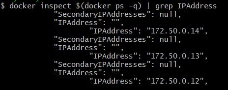
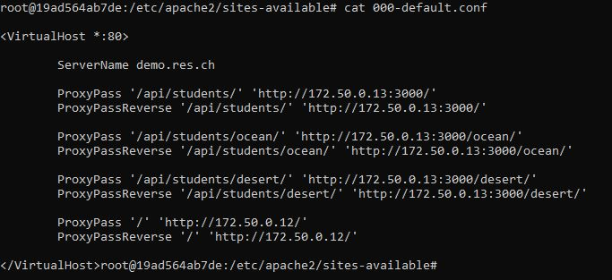
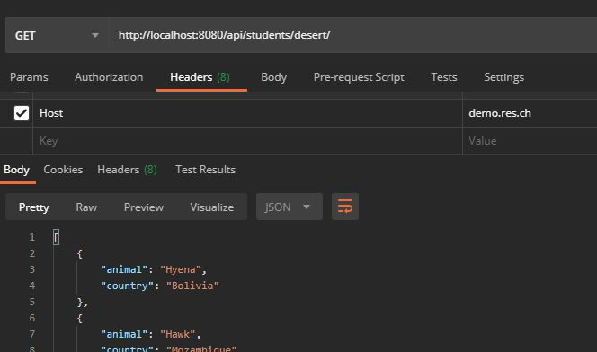

## Step 2

#### Mise en place

1. Construire l'image du reverse proxy dynamique avec `./build-image.sh` ou la commande `docker build -t httpinfra/reverse-proxy-dynamic .`. Il faut aussi avoir construit les images du step 1 et 2.
&nbsp;


2. Configurer le réseau virtuel sur lequel les conteneurs vont se connecter :

    Dans le fichier `docker-compose.yml` ligne 38, modifier
    ```
    - subnet: 172.50.0.0/16
    ```
    &nbsp;

3. Assigner des adresses IP aux conteneurs :

    Dans le fichier `docker-compose.yml` ligne 9 (apache statique), 18 (app nodejs dynamique) et 29 (apache reverse proxy dynamique)
    &nbsp;

4. Configurer les variables d'environnements qui seront transmises au conteneur apache reverse proxy :

    Dans le fichier `docker-compose.yml` ligne 31-32, modifier
    ```
    - STATIC_APP=172.50.0.2
    - DYNAMIC_APP=172.50.0.3:3000
    ```

    Attention, il faut évidemment que ces valeurs soient cohérentes avec les IP assignées aux conteneurs au point 3.
    &nbsp;

5. Démarrer les conteneurs avec `./run-container.sh` ou la commande `docker-compose up -d`

#### Demo

Après avoir effectué la mise en place ci-dessus, on se retrouve avec les 3 conteneurs :


On peut vérifier avec `docker inspect` que les conteneurs ont bien été assignés avec les IP statiques configurées dans le `docker-compose` :



On vérifie le bon fonctionnement avec Postman :



Si on venait à vouloir changer les IP de ces conteneurs, la configuration se ferait dans le `docker-compose` (modification des IPs statiques et des variables d'environnement) et il nous suffirait de relancer les conteneurs (pas besoin de rebuild l'image).

Modification des IPs statiques des conteneurs et des variables d'environnement en utilisant des adresses 172.50.0.1x :



On peut vérifier la configuration dynamique du vhost apache :



Et le fonctionnement est toujours assuré :




#### Implémentation de la solution

J'ai globalement repris les éléments de la vidéo sauf pour les IP des conteneurs. J'ai décidé d'assigner des IPs statique aux conteneurs afin de nous économiser le travail d'aller retrouver l'IP des conteneurs démarrés avec `docker inspect ...`. Comme ceci, on configure tout dans le fichier `docker-compose.yml`.
&nbsp;

##### Dockerfile

La description de l'image `httpinfra/reverse-proxy-dynamic` se base sur l'image `php:7.4-apache`.

1. 
    ```
    COPY apache2-foreground /usr/local/bin/
    ```
    On commence en premier lieu par copier le script `apache2-foreground`, c'est le script qui sera lancé au démarrage du conteneur (attention, le format de retour à la ligne doit être LF et non CRLF pour éviter des erreurs). Ce script existe déjà dans l'image de base et s'occupe de créer plusieurs fichiers "`(especially APACHE_RUN_DIR, APACHE_LOCK_DIR, and APACHE_LOG_DIR)`" avant de lancer le service apache `exec apache2 -DFOREGROUND "$@"`. Je me suis donc basé sur l'existant disponible à l'adresse https://github.com/docker-library/php/blob/master/7.4/buster/apache/apache2-foreground en lui ajoutant ligne 5 le lancement d'un script PHP `config-template.php` : 
    ```
    php /var/apache2/templates/config-template.php > /etc/apache2/sites-available/000-default.conf
    ```
    &nbsp;

2. 
    ```
    COPY templates /var/apache2/templates
    ```
    Ici je copie le script php (lancé par `apache2-foreground`) qui va s'occuper de générer les configs reverse proxy du vhost avec les adresses IP qui ont été transmises au lancement du conteneurs via les variables d'environnnement :
    ```
    <?php
        $dynamic_app = getenv('DYNAMIC_APP');
        $static_app = getenv('STATIC_APP');
    ?>

    <VirtualHost *:80>

        ServerName demo.res.ch

        ProxyPass '/api/students/' 'http://<?php print "$dynamic_app"?>/'
        ProxyPassReverse '/api/students/' 'http://<?php print "$dynamic_app"?>/'
        ...
    ```
    &nbsp;

3. 
    ```
    RUN a2enmod proxy proxy_http
    RUN a2ensite 000-*
    ```
    Puis rien de nouveau, on active les modules nécessaires au proxy et on active les vhosts.
    &nbsp;

##### docker-compose.yml

Ce fichier permet de définir les options de démarrage des conteneurs. 3 descriptions de conteneurs sont contenus dans ce fichier. On peut donc démarrer tous les conteneurs à la fois. À la fin de ce fichier (à partir de la ligne 33), je configure le sous-réseau qui sera utilisé par mes conteneurs :

```
networks:
  mynetwork:
    driver: bridge
    ipam:
      config:
        - subnet: 172.50.0.0/16
```

Ensuite, pour chaque conteneur, je lui définis une IP statique :

```
networks:
      mynetwork:
        ipv4_address: 172.50.0.13
```

Pour le conteneur proxy, je lui passe les variables d'environnements utilisées pour la génération du vhost par le script php :

```
environment:
      - STATIC_APP=172.50.0.12
      - DYNAMIC_APP=172.50.0.13:3000
```

Je configure également l'ordre de démarrage des conteneurs avec l'instruction `depends_on`. Bien que pas essentiel, c'est plus logique de démarrer d'abord les service et ensuite le proxy.